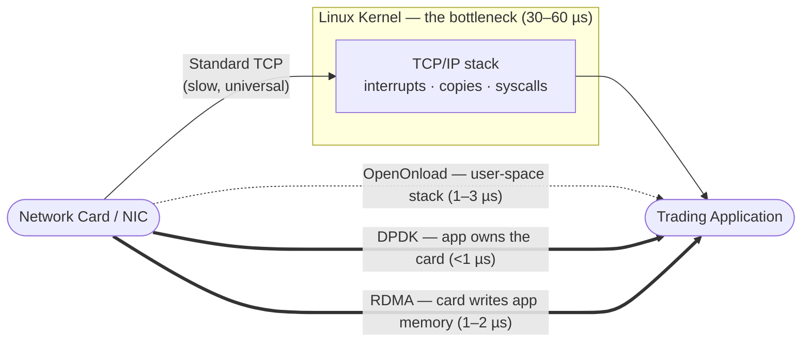

# The Microsecond Arms Race: Where Network Latency Hides in High-Frequency Trading — and How to Remove It

> **Computer Networks (DCCS307) · Module 5 Case Study · Group 07 · 2026**
>
> **Presentation video:** [▶ Watch on YouTube](https://youtu.be/REPLACE_WITH_VIDEO_LINK) *(mandatory link — replace with the final upload)*
> **Slides:** [`slides/CN_Group7.pdf`](slides/CN_Group7.pdf)

---

## About this post

This is a **four-person team project**. We each researched one part of a single question — *in high-frequency trading, where do the microseconds go, and how does the industry get them back?*

| Part | Topic | Research |
|------|-------|----------|
| 1 | The Problem — what HFT is, and which network delays software can control | Boseok Kim |
| **2** | **The Solution — kernel bypass: DPDK, OpenOnload, RDMA** | **Jungha Kim (me)** |
| 3 | Empirical Validation — TCP vs UDP measured with Docker + `tc netem` | Hanju Son |
| 4 | Industry Practice — NASDAQ, CME, NYSE, Citadel | Junseo Lee |

**My part was Part 2, kernel bypass.** So this post summarizes the other parts only as much as needed to follow the story, and goes into the most detail on Section 2 — why the Linux kernel is the single biggest latency bottleneck, and exactly how each bypass technique removes it.

**One-line summary of the whole project:**
The HFT bottleneck is *software*, not the speed of light. The kernel wastes 20–60 µs per round-trip (Part 2 attacks this), and TCP's loss-recovery mechanism can freeze an order for 200 ms (Part 3 measures this). Real exchanges solve both — with kernel bypass and a UDP/TCP protocol split (Part 4).

---

## Table of contents

1. [The Problem — why 1 µs is worth millions](#1-the-problem--why-1-µs-is-worth-millions)
2. [**The Solution — kernel bypass (my part, in depth)**](#2-the-solution--kernel-bypass)
3. [Empirical Validation — what 1% packet loss does to TCP](#3-empirical-validation--what-1-packet-loss-does-to-tcp)
4. [Industry Practice — how real exchanges apply all of this](#4-industry-practice--how-real-exchanges-apply-all-of-this)
5. [Conclusion & Future Directions](#5-conclusion--future-directions)
6. [Repository structure](#repository-structure) · [References](#references)

---

## 1. The Problem — why 1 µs is worth millions

*(Part 1 summary — Research: Boseok Kim)*

**High-Frequency Trading (HFT)** is automated trading where machines, not humans, decide and submit orders on microsecond timescales. Roughly **~50% of US equity trading volume** is HFT, and the economics of the latency race itself have been quantified at billions of dollars per year across the market [[1]](#references).

The key competitive rule is brutal: when a price moves, **only the first arriving order captures the trade**. Second place wins nothing. This has one important consequence for measurement:

> **The mean lies. HFT lives or dies at the tail.**
> A system with a *mean* round-trip of 100 µs but a *P99* (worst 1%) of 200 ms is unusable — 1 out of every 100 orders silently misses the opportunity. Our target metric for the whole project is therefore **P99 round-trip time under packet loss**.

### Where can software even help? The four delays

From Kurose & Ross [[2]](#references), every packet pays four "taxes" on its journey:

```
d_total  =  d_proc  +  d_queue  +  d_trans  +  d_prop
            (processing) (queueing)  (transmission) (propagation)
```

| Delay | What it is | How you reduce it | Can software move it? |
|---|---|---|---|
| `d_prop` propagation | Signal traveling through fiber | Move closer (co-location, microwave links) | No — physics / real estate |
| `d_trans` transmission | Pushing bits onto the wire | Buy 10/40/100 GbE links | No — effectively fixed after upgrade |
| `d_proc` **processing** | Header parsing, **kernel network stack**, copies | **Kernel bypass → Part 2** | **Yes** |
| `d_queue` **queueing** | Waiting in buffers; explodes non-linearly as load → capacity | **Protocol choice → Part 3** | **Yes** |

> **Light speed is fixed. Software isn't.** Only two of the four delays are software-controlled — and they happen to be exactly the two that dominate microsecond-scale systems. Part 2 attacks `d_proc`; Part 3 attacks `d_queue`.

One more property makes `d_queue` dangerous: it is **non-linear**. As traffic intensity ρ approaches 1, queueing delay doesn't grow gradually — it explodes from microseconds to milliseconds in a single burst of loss or retransmission [[2]](#references). Keep that in mind for Section 3.

---

## 2. The Solution — Kernel Bypass

*(Part 2 — Research: **Jungha Kim**. This is my part, covered in the most depth.)*

### 2.1 Where do the microseconds actually go?

Section 1 said `d_proc` is software-controlled. Here is the uncomfortable detail: in a standard TCP/IP stack, almost all of `d_proc` is spent **inside the Linux kernel** — the operating system code that sits between your network card and your application.

Let's dissect one full trading round-trip and put a price tag on every stage. The numbers below are typical figures from industry whitepapers (Solarflare, Intel DPDK Programmer's Guide) [[3]](#references)[[10]](#references); exact values depend on NIC, CPU, and tuning.

```
A single trading round-trip — where each microsecond goes:

  ┌─────────────┐   ┌──────────────────┐   ┌───────────────┐   ┌──────────────────┐   ┌─────────────┐
  │ NIC Receive │ → │ KERNEL TCP/IP RX │ → │ Trading Logic │ → │ KERNEL TCP/IP TX │ → │ NIC Transmit│
  │   ≈ 1–3 µs  │   │   ≈ 10–30 µs ███ │   │   ≈ 1–5 µs    │   │   ≈ 10–30 µs ███ │   │   ≈ 1–3 µs  │
  └─────────────┘   └──────────────────┘   └───────────────┘   └──────────────────┘   └─────────────┘
       card              ── BOTTLENECK ──        the actual          ── BOTTLENECK ──        card
                                                  strategy
```

| Stage | What happens | Cost |
|---|---|---|
| NIC receive | The network card copies the packet into memory (DMA) | ≈ 1–3 µs |
| **Kernel RX** | Interrupt, copy into kernel buffer, TCP/IP parsing, copy to the app | **≈ 10–30 µs** |
| Trading logic | The strategy decides what to do — *the only part that makes money* | ≈ 1–5 µs |
| **Kernel TX** | System call, build headers, copy, schedule for transmission | **≈ 10–30 µs** |
| NIC transmit | The card pushes the packet onto the wire | ≈ 1–3 µs |

Read the table again and the problem is obvious:

> A round-trip enters the kernel **twice** — once on receive, once on transmit — wasting **20–60 µs per round-trip**. The trading logic itself takes only 1–5 µs. **We spend roughly 10× more time shuffling packets than thinking about trades.** Top firms target tick-to-trade under 10 µs — a target that is *impossible* while the kernel is on the path.

### 2.2 Why is the kernel so slow? (It's not a bug)

The kernel is not slow because it is badly written. It is slow **by design** — it was built for safety, fairness, and generality across thousands of applications. HFT needs none of those. Four deliberate design choices cost microseconds:

| # | Mechanism | What it costs |
|---|---|---|
| 1 | **Interrupts** — every incoming packet "taps the CPU on the shoulder" (IRQ) | A context switch and polluted CPU caches, *per packet* |
| 2 | **Memory copies** — packet copied NIC ring → kernel buffer → user buffer | Hundreds of nanoseconds *per copy*, several copies per packet |
| 3 | **Context switching** — every `recv()`/`send()` crosses the user↔kernel boundary | Register and TLB flushes on every crossing |
| 4 | **Protocol processing** — full TCP state machine, congestion control, checksums, scheduling | Code written for *generality*, not for 1 µs targets |

Each mechanism exists for a good reason in a general-purpose OS. But stack them up and you get 10–30 µs *per direction* of pure overhead.

> **The logical deduction:** if the bottleneck is structural — built into the kernel's design — then tuning the kernel can only shave the edges. The real answer is to **take the kernel off the path entirely.** That single idea is what "kernel bypass" means.

### 2.3 Three ways to skip the kernel

The industry has three production techniques. All of them remove the kernel from the data path; they differ in **how much speed you gain vs. how much you must change**.

#### OpenOnload — the drop-in win (zero code change)

Your program keeps using ordinary sockets. A loader trick called `LD_PRELOAD` quietly **swaps the kernel's network code for a user-space copy** that runs inside your own process — every existing `recv()` / `send()` call is rerouted around the kernel automatically [[10]](#references).

- **Latency:** ≈ 1–3 µs
- **Code change:** none — same BSD socket API
- **The catch:** tied to specific NICs (historically Solarflare, now AMD)
- **Best for:** getting a large latency win on an existing codebase, today

#### DPDK — the fastest, at the price of a rewrite

The **Data Plane Development Kit** hands the network card directly to your application. Three mechanisms do the work [[3]](#references)[[11]](#references):

- **Poll-mode driver (PMD)** — instead of waiting for an interrupt ("shoulder tap"), the app **busy-polls**: it checks the card in a tight loop, constantly. No interrupts, no context switches.
- **Huge pages** — 2 MB / 1 GB memory pages mean far fewer expensive address lookups (TLB misses) on packet buffers.
- **Zero-copy ring buffers + CPU pinning** — the card and the app share memory directly (no copies), and the polling work is pinned to one fixed CPU core close to that memory (NUMA pinning).

- **Latency:** < 1 µs
- **Code change:** **full rewrite** — no sockets at all
- **The catch:** one CPU core spins at 100% forever, even when no packets arrive
- **Best for:** new ("greenfield") systems chasing absolute minimum latency

#### RDMA — let the card do everything

**Remote Direct Memory Access** goes the furthest: the network card **reads and writes the memory of another machine directly** — the remote CPU is not involved in the transfer at all. Instead of sockets it uses a *verbs API* (queue pairs, work requests, completion queues). Its speed comes from three independent properties [[5]](#references):

1. **Kernel bypass** — the app talks to the device directly
2. **Zero-copy** — the card accesses application memory directly, no kernel-to-user copy
3. **Polling** — the app polls completion queues instead of taking interrupts

- **Latency:** ≈ 1–2 µs, zero-copy
- **Code change:** new programming model (verbs, not sockets)
- **The catch:** needs an **InfiniBand or RoCE** network fabric, not ordinary Ethernet
- **Best for:** server-to-server traffic *inside* a datacenter

### 2.4 Where each technique cuts the kernel out



*Standard TCP (solid arrow) is the only path through the kernel. Every bypass technique routes around it — the more directly, the faster.*

### 2.5 The comparative matrix

| Option | Latency | Code change | Hardware | Best for |
|---|---|---|---|---|
| **Standard TCP/IP** | 30–60 µs · 200 ms+ tail on loss | None | Any NIC | Compatibility |
| **OpenOnload** | 1–3 µs | None (`LD_PRELOAD`) | Solarflare/AMD NIC | Drop-in kernel bypass |
| **DPDK** | < 1 µs | Full rewrite | DPDK-capable NIC | Greenfield ultra-low latency |
| **RDMA** | 1–2 µs · zero-copy | New verbs API | InfiniBand / RoCE | Intra-datacenter |

> **The trade-off is always the same: the more of the kernel you bypass, the faster you go — and the more your code and hardware must change.** There is no free lunch; you choose your position on this curve based on how much rewrite and hardware lock-in you can afford.

One honest limitation: the latency figures above come from vendor whitepapers and documentation — we could not measure DPDK or RDMA ourselves (they need special NICs). What we *could* measure on our own machines is the layer underneath: the raw **TCP vs UDP** behavior that all of these stacks ultimately ride on. That is Part 3.

---

## 3. Empirical Validation — what 1% packet loss does to TCP

*(Part 3 summary — Research: Hanju Son. This is the team's primary data.)*

**Setup.** A client and server in two Docker containers connected through a Docker bridge — a real network interface, not loopback (loopback would skip the NIC path entirely). `tc netem` on the server's egress injects *reproducible* packet loss. Python 3, raw sockets, 10,000 orders per run at 100 µs spacing.

```
hft-client (10.10.0.3) ──── Docker bridge 10.10.0.0/24 ──── hft-server (10.10.0.2)
                              + tc netem on server eth0          TCP 8888 · UDP 8888
```

**Result.** The baseline is boring — and that's the point:

| Condition | Metric | TCP | UDP |
|---|---|---|---|
| **No loss** | Mean RTT | 188.6 µs | 178.0 µs |
| | P99 RTT | 375.7 µs | 386.1 µs |
| **1% loss** | Mean RTT | **2,306 µs** | 177.9 µs |
| | P99 RTT | **204,812 µs (≈ 205 ms)** | 374.5 µs |
| | Delivered | 1000/1000 | 992/1000 |

With no loss, protocol choice barely matters (~10 µs gap). Add **just 1% packet loss** and TCP's P99 explodes by **~545×** to 205 ms, while UDP's tail doesn't move.

**Why exactly 200 ms?** One constant in the Linux kernel source: `TCP_RTO_MIN = HZ/5` → **200 ms** (defined in `include/net/tcp.h` [[4]](#references)). TCP cannot detect a lost packet faster than its retransmission timeout, and Linux hardcodes the floor of that timeout at 200 ms. On a 180 µs network, one lost packet means TCP **waits at least 200 ms** — a thousand times the normal RTT — before even retrying.

> **TCP guarantees delivery — but its guarantee mechanism *is* the latency.** UDP simply refuses to wait: it lost 8 of 1,000 orders but delivered the other 992 at baseline speed. This is Section 1's non-linear `d_queue` blow-up, measured on our own machine.

For HFT the trade-off has exactly the right shape: a missed market-data tick is *recoverable* (the next update replaces it in microseconds), but a 200 ms stall is *permanent* — the opportunity is gone.

---

## 4. Industry Practice — how real exchanges apply all of this

*(Part 4 summary — Research: Junseo Lee)*

Part 3 showed a single protocol can't win on both speed and reliability. The industry's answer: **don't pick one — pick both, by purpose.**

| Exchange | Market data (speed-critical) | Order entry (correctness-critical) |
|---|---|---|
| **NASDAQ** | TotalView-ITCH over MoldUDP64 — UDP multicast [[7]](#references) | OUCH over TCP |
| **CME** | MDP 3.0 — UDP multicast + SBE binary encoding [[6]](#references) | iLink 3 over TCP |
| **NYSE** | Pillar — UDP multicast, redundant A/B lines [[8]](#references) | Pillar FIX Gateway over TCP |

Three exchanges, independently built, independently the same answer: **UDP multicast for the broadcast, TCP for the per-client transaction.**

CME adds a clever hybrid [[6]](#references): every UDP message carries a sequence number; if a subscriber sees a gap (… 101, *[lost]*, 103 …), it requests that one packet over a **separate TCP recovery channel**. The hot path stays on UDP; reliability is paid for *only by those who need it, only when they need it*.

Top HFT firms (Citadel Securities, Jane Street, Jump Trading, Virtu) apply the same recipe, harder — UDP for data, TCP for orders, **kernel bypass for both**, plus FPGA-accelerated decoding [[9]](#references). The direct mapping to our data:

| Our experiment said… | Industry does… |
|---|---|
| TCP P99 explodes to 205 ms under 1% loss | Market data goes over UDP multicast (NASDAQ) |
| UDP loses 8/1000 but the tail stays flat | UDP + TCP recovery only on gaps (CME) |
| TCP guarantees delivery at the cost of tail latency | TCP for order entry, where correctness > speed (NYSE) |
| Kernel adds 20–60 µs per round-trip (Part 2) | Both channels accelerated via kernel bypass (Citadel, Virtu) |

> **We didn't just summarize the industry. We measured the exact trade-off the entire industry is built around.**

---

## 5. Conclusion & Future Directions

**What we learned**

1. The HFT bottleneck is **software, not physics** — `d_proc` + `d_queue`, the two delays software can move.
2. **Kernel bypass** (DPDK / OpenOnload / RDMA) attacks `d_proc`: 20–60 µs of kernel overhead per round-trip drops to 1–3 µs.
3. **Protocol split** (UDP + TCP) attacks `d_queue` and tail latency: a 200 ms RTO stall never reaches the hot path.
4. Both layers must be optimized **together** — a kernel-bypassed stack still stalls 200 ms if it rides TCP through loss, and UDP still wastes 20–60 µs if it goes through the kernel. Neither alone is enough.

**Limitations.** Our benchmark uses Python on a Docker bridge — the ~188 µs baseline includes interpreter overhead, so absolute numbers are far from production (sub-10 µs). The *relative* finding (TCP tail blow-up vs. flat UDP tail under loss) is what transfers. `tc netem` also injects independent random loss; real loss is bursty, which would make TCP's tail even worse.

**Future directions**

- **QUIC / SRT** — user-space transports with built-in, selective loss recovery: can they give TCP-like guarantees without the 200 ms floor?
- **SmartNICs & P4-programmable switches** — pushing protocol logic into the network fabric itself.
- **FPGA acceleration** — tick-to-trade entirely in hardware [[9]](#references), at the cost of development agility.
- The real question for the next five years: **how much of a trading strategy can fit inside the NIC itself?**

> **1 µs is not just a number.** It is the line between a profitable trade and a missed one — and an entire technology stack has been built to chase it.

---

## Repository structure

```
Network_2026_1/
├── README.md            ← this tech blog
└── slides/
    └── CN_Group7.pdf    ← presentation deck (full slides, figures, and benchmark charts)
```

All figures referenced in this post (the mean-vs-P99 distribution curve, the 545× P99 bar chart, and the full benchmark tables) are included in the slide deck. The benchmark methodology and raw numbers are documented in Section 3.

---

## References

1. M. Aquilina, E. Budish, and P. O'Neill. "Quantifying the High-Frequency Trading 'Arms Race'." *Quarterly Journal of Economics*, 137(1):493–564, 2022. DOI: [10.1093/qje/qjab032](https://doi.org/10.1093/qje/qjab032).
2. J. F. Kurose and K. W. Ross. *Computer Networking: A Top-Down Approach*, Chapters 1 & 3 (delay decomposition; queueing delay vs. traffic intensity ρ).
3. Intel / Linux Foundation. *DPDK Programmer's Guide* (poll-mode drivers, huge pages, zero-copy). <https://doc.dpdk.org/guides/prog_guide/>. Latency figures also from Solarflare/AMD whitepapers.
4. Linux kernel source. `TCP_RTO_MIN` definition, `include/net/tcp.h` (`#define TCP_RTO_MIN ((unsigned)(HZ/5))` → 200 ms). <https://github.com/torvalds/linux/blob/master/include/net/tcp.h>.
5. K. Taranov et al. "CoRD: Converged RDMA Dataplane for High-Performance Clouds" (RDMA's three properties: kernel bypass, zero-copy, polling). arXiv:2309.00898.
6. CME Group. *MDP 3.0 — Market Data Platform & Channel Recovery Documentation* (UDP multicast + SBE encoding; TCP recovery channel).
7. NASDAQ. *TotalView-ITCH 5.0 Specification* and *OUCH* order-entry protocol (MoldUDP64 transport).
8. NYSE. *Pillar Gateway Technical Reference* (UDP multicast market data with redundant A/B lines; FIX over TCP).
9. J. W. Lockwood et al. "A Low-Latency Library in FPGA Hardware for High-Frequency Trading (HFT)." *IEEE 20th Annual Symposium on High-Performance Interconnects (HOTI)*, 2012.
10. AMD/Solarflare. *OpenOnload* — user-space network stack with `LD_PRELOAD` socket acceleration. <https://www.openonload.org/>.
11. *Joyride: Rethinking Linux's Network Stack* (DPDK mechanism reference: PMD, huge pages, zero-copy ring buffers). arXiv:2509.25015.

---

*Group 07 · Computer Networks (DCCS307), Module 5 · 2026. Built and measured end-to-end by the team.*
